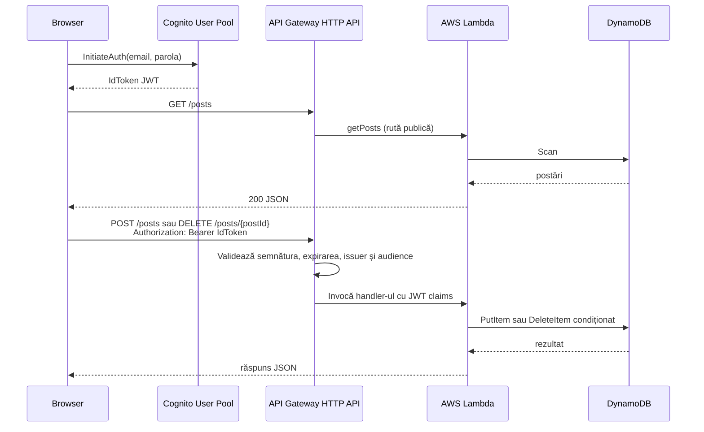

# Documentație tehnică: Blog serverless AWS

## 1. Scop

Acest proiect implementează un blog minimal, complet serverless:

- Oricine poate lista postările.
- Un utilizator autentificat poate crea postări.
- Un utilizator autentificat poate șterge numai postările proprii.

Infrastructura este definită în `template.yaml` prin AWS SAM, iar aplicația este alcătuită dintr-un frontend static și trei funcții AWS Lambda.

## 2. Arhitectură

| Componentă | Rol |
|---|---|
| Frontend static | Interfață HTML/JavaScript care autentifică utilizatorul și apelează API-ul. |
| Amazon Cognito User Pool | Stochează utilizatori, aplică politica de parole și emite tokenuri JWT. |
| API Gateway HTTP API | Expune rutele HTTP, aplică CORS și validează JWT pentru rutele protejate. |
| AWS Lambda | Execută operațiile API și consumă mesajele din cozi. |
| Amazon DynamoDB | Stochează postările, în mod on-demand. |
| Amazon S3 (imagini) | Stochează imaginile postărilor; upload și citire exclusiv prin presigned URL-uri. |
| Amazon SNS | Fan-out la publicarea unei postări: email opțional și coadă SQS. |
| Amazon SQS | Decuplează procesarea asincronă; retry automat și dead-letter queue. |
| Amazon S3 + CloudFront (site) | Găzduiește frontend-ul: bucket privat citit doar de CloudFront prin Origin Access Control. |
| CodePipeline + CodeBuild | CI/CD: la fiecare push pe GitHub rulează build, deploy și publicarea frontend-ului. |
| IAM | Acordă fiecărei funcții Lambda numai acțiunile necesare. |



## 3. Resursele create de SAM

Fișierul `template.yaml` creează următoarele resurse:

- `PostsTable`: tabel DynamoDB numit `<numele-stack-ului>-posts`, cu facturare `PAY_PER_REQUEST`.
- `UserPool`: Cognito User Pool în care utilizatorii se autentifică prin email.
- `UserPoolClient`: client Cognito fără secret, potrivit pentru un browser. Acceptă autentificarea `USER_PASSWORD_AUTH` și refresh token-uri.
- `BlogApi`: API Gateway HTTP API cu stage configurabil, implicit `prod`.
- `CreatePostFunction`, `GetPostsFunction`, `DeletePostFunction`, `GetUploadUrlFunction`: funcțiile Lambda din spatele API-ului.
- `ImagesBucket`: bucket S3 privat pentru imaginile postărilor; notifică `ImageEventsQueue` la fiecare obiect creat sub prefixul `uploads/`.
- `PostEventsTopic`: topic SNS publicat de `createPost`; are două abonamente — un email opțional (parametrul `NotificationEmail`) și `PostEventsQueue`.
- `PostEventsQueue` + `PostEventsDLQ`: coadă SQS consumată de `ProcessPostEventFunction`; după 3 eșecuri mesajul ajunge în DLQ.
- `ImageEventsQueue` + `ImageEventsDLQ`: coadă SQS consumată de `ProcessImageUploadFunction`, alimentată de evenimentele S3 `ObjectCreated`.
- `SiteBucket`, `SiteDistribution`, `SiteOriginAccessControl`: hosting-ul frontend-ului — bucket privat + distribuție CloudFront cu OAC.

Toate funcțiile Lambda folosesc Node.js 22, arhitectură ARM64, 256 MB memorie, timeout de 10 secunde și codul din directorul `src/`. Numele tabelului este transmis prin variabila de mediu `TABLE_NAME`, nu este scris direct în cod.

### CORS

Originea permisă implicit este `http://localhost:8000`, configurabilă prin parametrul SAM `AllowedOrigin`. Sunt permise metodele `GET`, `POST`, `DELETE`, `OPTIONS` și headerele `authorization`, `content-type`.

La deploy, stack-ul expune `ApiUrl`, `UserPoolId`, `UserPoolClientId`, `Region`, `PostsTableName`, `ImagesBucketName`, `SiteBucketName`, `SiteUrl`, `SiteDistributionId` și `PostEventsTopicArn`.

## 4. Autentificare și autorizare

`BlogApi` are configurat un authorizer JWT Cognito ca authorizer implicit. API Gateway citește tokenul din headerul `Authorization`, verifică tokenul înainte de invocarea Lambda și acceptă cererea numai când semnătura, expirarea, `issuer` și `audience` sunt valide.

`GET /posts` este excepția: setează explicit `Authorizer: NONE`, deci poate fi apelat fără token. `POST` și `DELETE` moștenesc authorizer-ul implicit și sunt protejate.

După validare, API Gateway transmite claim-urile către Lambda prin `event.requestContext.authorizer.jwt.claims`. Helperul `getUser()` extrage:

- `sub`: identificator Cognito stabil și imuabil; este folosit pentru verificarea proprietarului.
- `email`: folosit pentru afișarea autorului.

Identitatea nu este acceptată din corpul cererii. Astfel, un client nu poate declara că publică sau șterge în numele altui utilizator.

## 5. Modelul de date

Tabelul DynamoDB are doar cheia de partiție `postId` de tip string. Celelalte atribute sunt schemaless:

| Atribut | Tip | Semnificație |
|---|---|---|
| `postId` | String | Cheia primară, UUID v4 generat la creare. |
| `title` | String | Titlul postării. |
| `content` | String | Conținutul postării. |
| `author` | String | Email-ul extras din JWT, pentru afișare. |
| `authorSub` | String | Identificatorul Cognito al autorului, utilizat intern pentru autorizarea ștergerii. |
| `createdAt` | String | Momentul creării în format ISO 8601. |

Tabelul nu are sort key și nici Global Secondary Index (GSI). Prin urmare, listarea tuturor postărilor folosește `Scan`, nu `Query`.

## 6. Contractul API

### `GET /posts`

- Autentificare: nu este necesară.
- Handler: `getPosts.handler`.
- Operație DynamoDB: `Scan`, limitat la 50 de itemi.
- Permisiune IAM: `dynamodb:Scan` doar pe tabel.
- Răspuns reușit: `200`.

Exemplu de răspuns:

```json
{
  "count": 1,
  "posts": [
    {
      "postId": "4d08c1bb-2aea-456d-b137-a52461c555aa",
      "title": "Prima postare",
      "content": "Salut din Lambda!",
      "author": "eu@exemplu.com",
      "createdAt": "2026-07-28T10:30:00.000Z"
    }
  ]
}
```

Rezultatele sunt sortate în memorie, descrescător după `createdAt`. Câmpul intern `authorSub` este eliminat înainte ca răspunsul să fie trimis clientului. Pentru postările care au o imagine atașată, `imageKey` este înlocuit cu `imageUrl` — un presigned GET URL valabil o oră, deoarece bucket-ul de imagini este privat.

### `POST /uploads`

- Autentificare: obligatorie; header `Authorization: Bearer <IdToken>`.
- Handler: `getUploadUrl.handler`.
- Permisiune IAM: `s3:PutObject` doar pe prefixul `uploads/` al bucket-ului de imagini.
- Corp cerere: `{"contentType": "image/png"}` — acceptate: `image/jpeg`, `image/png`, `image/webp`, `image/gif`.
- Răspuns: `{"uploadUrl": "...", "imageKey": "uploads/<sub>/<uuid>.png", "expiresIn": 300}`.

Funcția nu primește fișierul. Ea generează un presigned PUT URL valabil 5 minute, iar browserul urcă fișierul direct în S3. `ContentType` face parte din semnătură, deci URL-ul nu poate fi folosit pentru alt tip de fișier. Cheia conține `sub`-ul utilizatorului, ceea ce permite verificarea proprietății la crearea postării.

### `POST /posts`

- Autentificare: obligatorie; header `Authorization: Bearer <IdToken>`.
- Handler: `createPost.handler`.
- Permisiune IAM: `dynamodb:PutItem` doar pe tabel.
- Corp cerere:

```json
{
  "title": "Titlu",
  "content": "Conținut",
  "imageKey": "uploads/<sub>/<uuid>.png"
}
```

`title` și `content` sunt eliminate de spații la capete și trebuie să fie ne-goale. `imageKey` este opțional; dacă este prezent, trebuie să înceapă cu `uploads/<sub-ul utilizatorului curent>/`, altfel cererea primește `400` — un utilizator nu poate atașa imaginea altcuiva. JSON invalid produce `400`, la fel ca lipsa unuia dintre câmpurile obligatorii. Handler-ul generează `postId`, completează `author`, `authorSub` și `createdAt` din server, apoi scrie itemul cu condiția `attribute_not_exists(postId)`.

După scrierea reușită, handler-ul publică un mesaj în topicul SNS `PostEventsTopic`. Un eșec al publicării este doar logat — postarea este deja salvată, deci utilizatorul primește tot `201`.

La succes, răspunsul este `201` cu postarea completă. În cazul unui apel local fără authorizer și fără claim-ul `sub`, handler-ul răspunde cu `401`.

### `DELETE /posts/{postId}`

- Autentificare: obligatorie; header `Authorization: Bearer <IdToken>`.
- Handler: `deletePost.handler`.
- Parametru cale: `postId`.
- Permisiune IAM: `dynamodb:DeleteItem` doar pe tabel.

Ștergerea este autorizată atomic în DynamoDB:

```text
attribute_exists(postId) AND authorSub = :me
```

`:me` este `sub` din tokenul autentificat. DynamoDB verifică simultan că postarea există și că îi aparține utilizatorului curent; numai apoi o șterge. Nu există un `GetItem` înainte de `DeleteItem`, deci nu apare o fereastră de tip read-then-write race condition.

La eșecul condiției, handler-ul răspunde cu `403` și mesajul `Postarea nu există sau nu îți aparține`. Mesajul nu arată dacă postarea a lipsit sau doar aparține altcuiva, astfel încât nu confirmă existența unei postări unui utilizator neautorizat.

## 7. Backend Lambda

`src/lib/ddb.mjs` creează un `DynamoDBDocumentClient` o singură dată, în afara handler-elor. La invocările warm, Lambda reutilizează clientul și conexiunile HTTPS existente. Document client-ul permite lucrul cu obiecte JavaScript obișnuite, fără formatul DynamoDB cu marcaje `S`, `N` sau `B`.

`src/lib/http.mjs` oferă:

- `json(statusCode, data)`: construiește răspunsuri HTTP API cu body JSON stringificat.
- `error(statusCode, message)`: construiește un răspuns de eroare JSON.
- `parseBody(event)`: parsează corpul JSON și decodează corpuri base64 când este necesar.
- `getUser(event)`: citește `sub` și `email` din claim-urile validate de API Gateway.

Fiecare funcție primește minimum de privilegii. `createPost` nu poate citi sau șterge, `getPosts` nu poate modifica, iar `deletePost` nu poate citi date înainte de ștergere. Permisiunile de logare CloudWatch sunt adăugate automat de SAM.

### Procesarea asincronă (SNS și SQS)

Două fluxuri asincrone rulează în spatele API-ului:

1. **Postare nouă**: `createPost` → SNS `PostEventsTopic` → fan-out către emailul opțional și `PostEventsQueue` → `processPostEvent.mjs`, care marchează postarea cu `notifiedAt` printr-un `UpdateItem` condiționat (`attribute_exists(postId)`).
2. **Imagine urcată**: PUT-ul presigned în S3 → notificare `ObjectCreated` → `ImageEventsQueue` → `processImageUpload.mjs`, care citește metadatele obiectului (`HeadObject`) și le loghează — punct de extensie pentru redimensionare sau moderare.

Ambii consumatori folosesc `ReportBatchItemFailures`: la eșec, doar mesajele eșuate sunt raportate prin `batchItemFailures` și reîncercate de SQS, nu întregul batch. După 3 eșecuri, mesajul este mutat în DLQ-ul cozii pentru inspecție. Abonamentul SQS la SNS folosește `RawMessageDelivery: true`, astfel încât body-ul mesajului este direct JSON-ul publicat, fără anvelopa SNS.

## 8. Frontend

Frontendul nu are dependențe externe. `frontend/index.html` oferă interfața, iar `frontend/app.js` gestionează autentificarea și apelurile API.

Fluxul este următorul:

1. Un utilizator nou completează emailul, parola și confirmarea parolei în formularul de înregistrare.
2. Browserul apelează operația publică Cognito `SignUp`. User Pool-ul este configurat cu `AutoVerifiedAttributes: [email]`, astfel încât Cognito trimite un cod de confirmare pe email.
3. Utilizatorul introduce codul primit; browserul apelează `ConfirmSignUp`. La cod invalid sau expirat, Cognito întoarce o eroare. Utilizatorul poate cere un cod nou prin `ResendConfirmationCode`.
4. După confirmarea reușită, aplicația revine la Login cu emailul completat. Parola nu este păstrată de aplicație.
5. Browserul apelează `InitiateAuth`, cu fluxul `USER_PASSWORD_AUTH`, pentru a autentifica utilizatorul confirmat.
6. Cognito întoarce un `IdToken` JWT. Este folosit deoarece conține claim-ul `email` necesar backendului.
7. Tokenul și emailul extras din payload sunt păstrate în `sessionStorage`.
8. Helperul `api()` atașează automat `Authorization: Bearer <IdToken>` când tokenul există.
9. La răspuns `401`, tokenul este șters și interfața revine la starea neautentificată.

Postările sunt afișate după ce `app.js` le escapează cu `escapeHtml()`, prevenind injectarea de HTML de către conținutul introdus de utilizatori. Butonul de ștergere apare în interfață numai când emailul din sesiune coincide cu `author`; backendul rămâne însă autoritatea finală, deoarece verifică `authorSub` în DynamoDB.

### Upload-ul de imagini

Formularul de postare acceptă opțional o imagine (max 5 MB, JPEG/PNG/WebP/GIF). Fluxul:

1. Browserul apelează `POST /uploads` cu `contentType`-ul fișierului și primește `uploadUrl` + `imageKey`.
2. Browserul urcă fișierul direct în S3 printr-un `PUT` către `uploadUrl`, cu același `Content-Type` (parte din semnătură).
3. `imageKey` este inclus în corpul `POST /posts`; backendul validează că aparține utilizatorului curent.
4. La listare, `GET /posts` întoarce `imageUrl` (presigned GET, valabil o oră), pe care frontend-ul îl afișează într-un ``.

### Configurarea frontendului

`deploy.ps1` actualizează automat `frontend/config.js` după un deploy reușit. Scriptul citește `ApiUrl`, `UserPoolClientId` și `Region` din output-urile CloudFormation ale stack-ului configurat în `samconfig.toml`. Nu este necesară copierea manuală a valorilor.

Fișierul generat are forma:

```js
window.CONFIG = {
  API_URL: 'https://<api-id>.execute-api.<regiune>.amazonaws.com/prod',
  USER_POOL_CLIENT_ID: '<UserPoolClientId>',
  REGION: '<regiune>',
};
```

Aceste valori nu sunt secrete. URL-ul API este public, iar clientul Cognito este configurat intenționat fără secret, deoarece codul rulează în browser.

## 9. Instalare, deploy și rulare

### Cerințe

- AWS CLI v2, configurat cu `aws configure`.
- AWS SAM CLI.
- Node.js 18 sau mai nou.
- Python, sau orice server HTTP static, pentru servirea frontendului local.

### Build și deploy

Din rădăcina proiectului:

```powershell
.\deploy.ps1
```

Scriptul execută, în ordine, `sam build`, `sam deploy` și sincronizarea automată a configurației frontendului. Build-ul instalează dependențele din `src/`; deploy-ul creează resursele AWS, iar ultimul pas scrie valorile reale în `frontend/config.js` numai după ce toate output-urile obligatorii au fost găsite. Dacă stack-ul expune `SiteBucketName` și `SiteDistributionId`, scriptul sincronizează apoi directorul `frontend/` în bucket-ul sitului și invalidează cache-ul CloudFront (`--paths "/*"`); adresa publică este output-ul `SiteUrl`.

Primul deploy care creează distribuția CloudFront durează 5–10 minute. Pentru notificări email la fiecare postare nouă, deploy-ul se face cu `--parameter-overrides NotificationEmail=<adresa>`; SNS trimite un email de confirmare care trebuie acceptat înainte ca notificările să fie livrate.

La primul deploy, `sam deploy` va cere numele stack-ului, regiunea și confirmarea pentru crearea rolurilor IAM. Opțiunile sunt salvate în `samconfig.toml`. Pentru un alt stack sau o altă regiune:

```powershell
.\deploy.ps1 -StackName alt-stack -Region eu-west-1
```

Poți consulta output-urile și manual pentru teste AWS CLI:

```powershell
aws cloudformation describe-stacks --stack-name <nume-stack> `
  --query "Stacks[0].Outputs" --output table
```

### Înregistrarea unui utilizator

După rularea `deploy.ps1`, deschide frontendul, alege `Înregistrează-te`, completează emailul și parola, apoi confirmă contul cu codul primit prin email. Nu este necesar un endpoint Lambda suplimentar: browserul comunică direct cu operațiile publice Cognito `SignUp`, `ConfirmSignUp` și `ResendConfirmationCode`.

Parola trebuie să aibă minimum opt caractere, literă mică, literă mare și cifră, conform politicii User Pool. Folosește un email real, deoarece codul de confirmare este trimis la acea adresă.

### Crearea administrativă a unui utilizator de test

```powershell
aws cognito-idp admin-create-user `
  --user-pool-id <UserPoolId> `
  --username eu@exemplu.com `
  --user-attributes Name=email,Value=eu@exemplu.com Name=email_verified,Value=true `
  --message-action SUPPRESS

aws cognito-idp admin-set-user-password `
  --user-pool-id <UserPoolId> `
  --username eu@exemplu.com `
  --password 'Parola123' `
  --permanent
```

Opțiunea `--permanent` este importantă: fără ea Cognito cere schimbarea parolei la primul login și nu trimite direct tokenuri. Acest flux CLI este util pentru administrare și teste, dar nu este necesar pentru înregistrarea din interfață.

### Pornirea frontendului

După rularea `deploy.ps1`:

```powershell
cd frontend
python -m http.server 8000
```

Deschide `http://localhost:8000`. Portul și originea trebuie să corespundă valorii `AllowedOrigin` din stack; implicit, ambele folosesc `http://localhost:8000`. Alternativ, după un deploy complet, frontend-ul este disponibil public la adresa din output-ul `SiteUrl` (CloudFront) — originea CloudFront este permisă automat în CORS.

### CI/CD cu CodePipeline

`pipeline.yaml` este un stack separat, instalat o singură dată, care creează: o conexiune CodeConnections către GitHub, un bucket de artefacte, un proiect CodeBuild și pipeline-ul cu două etape (Source → Build). CodeBuild rulează `buildspec.yml`, care reproduce pașii lui `deploy.ps1` în bash: `sam build`, `sam deploy --no-confirm-changeset --no-fail-on-empty-changeset`, generarea `config.js` din output-uri, `aws s3 sync` și invalidarea CloudFront.

Instalare:

```powershell
aws cloudformation deploy `
  --template-file pipeline.yaml `
  --stack-name blog-pipeline `
  --capabilities CAPABILITY_IAM `
  --parameter-overrides GitHubRepo=<user>/<repo>
```

După instalare, conexiunea GitHub rămâne în starea *Pending* până este autorizată manual în consolă (*Developer Tools → Settings → Connections → Update pending connection*). Din acel moment, fiecare push pe branch-ul configurat (implicit `main`) declanșează pipeline-ul. Rolul CodeBuild folosește `AdministratorAccess` — acceptabil doar într-un cont de învățare; în producție se restrânge la permisiunile exacte cerute de stack.

## 10. Limitări actuale și pași pentru producție

- API-ul oferă create, read și delete, dar nu are operație de editare (`PUT` sau `PATCH`).
- `GET /posts` folosește `Scan` și `Limit: 50`. Nu folosește `LastEvaluatedKey`, deci rezultatele după prima pagină nu sunt expuse. Pentru trafic mare, un GSI cu o cheie de grupare și `createdAt` ca sort key ar permite `Query` și paginație.
- Tokenul este în `sessionStorage`. Acesta dispare la închiderea tab-ului, dar poate fi accesat de scripturi injectate prin XSS. O aplicație de producție ar folosi un flux de refresh și cookie-uri `HttpOnly`, `Secure` și `SameSite` gestionate de backend.
- Presigned GET URL-urile pentru imagini se generează la fiecare listare (un apel de semnare per postare cu imagine). La trafic mare, s-ar servi imaginile printr-o distribuție CloudFront cu OAC peste bucket-ul de imagini.
- `processImageUpload` doar loghează metadatele; nu validează conținutul real al fișierului (un client poate declara `image/png` pentru alt conținut) și nu generează thumbnails.
- Imaginile orfane (urcate dar neatașate unei postări, sau ale postărilor șterse) nu sunt curățate; o regulă de lifecycle S3 sau un proces periodic ar rezolva.
- Nu sunt definite alarme CloudWatch, dashboard-uri sau tracing X-Ray pentru erori Lambda, erori API și consumul DynamoDB.
- `sam local start-api` nu aplică authorizer-ul JWT API Gateway. Testele locale trebuie să țină cont că handler-ele pot primi claim-uri lipsă; testele de autorizare reale trebuie rulate pe API-ul deployat sau cu evenimente simulate care conțin claim-uri.

## 11. Curățarea resurselor

Pentru a elimina infrastructura creată de proiect și a evita costuri viitoare:

```powershell
# Bucket-urile S3 trebuie golite înainte — CloudFormation nu șterge bucket-uri pline:
aws s3 rm s3://<numele-stack-ului>-images --recursive
aws s3 rm s3://<numele-stack-ului>-site --recursive

sam delete

# Pipeline-ul CI/CD, dacă a fost instalat, este un stack separat:
aws cloudformation delete-stack --stack-name blog-pipeline
```

Confirmă numele stack-ului înainte de ștergere. Operația elimină resursele create de CloudFormation, inclusiv tabela cu postări, cozile SQS, topicul SNS și distribuția CloudFront.